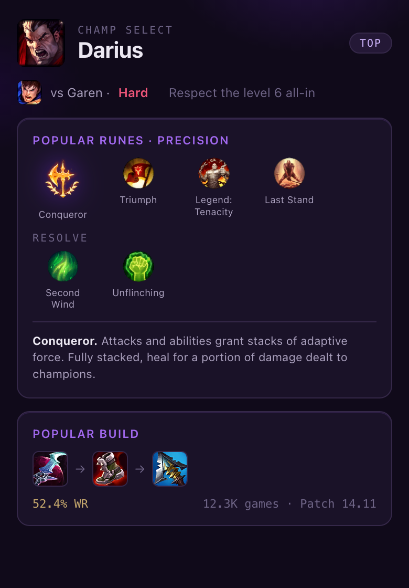
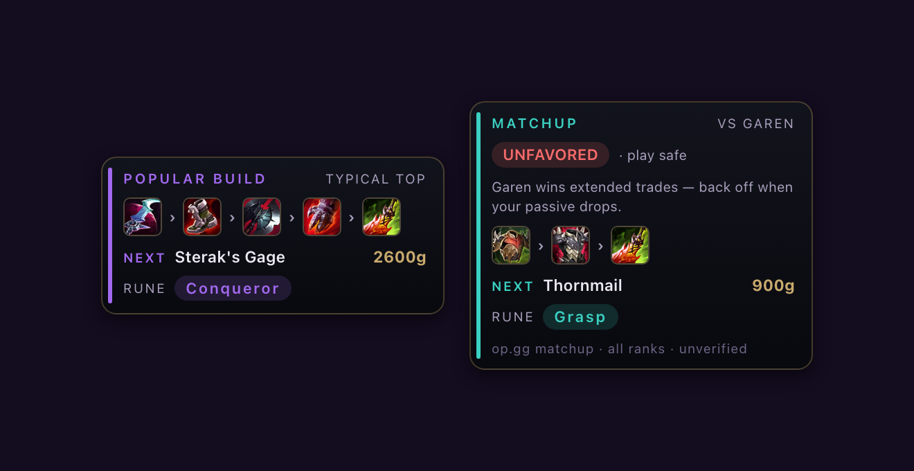
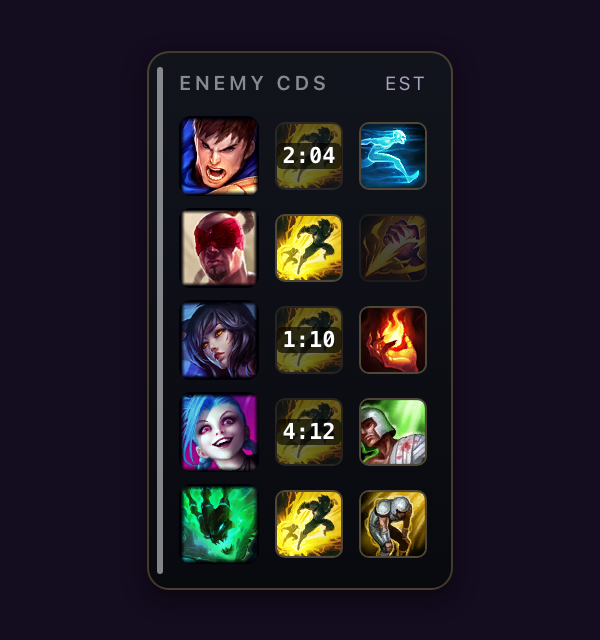
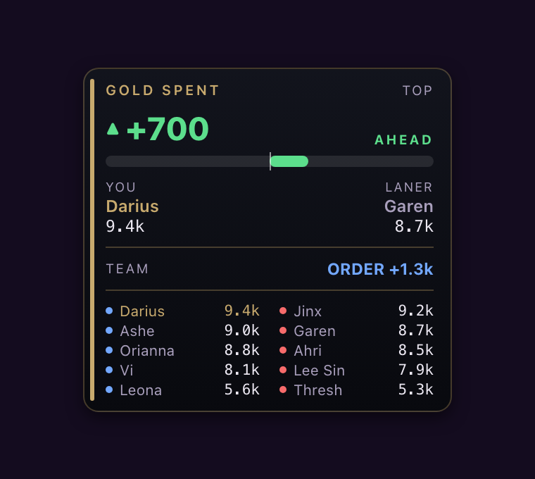

# Rift Companion — League of Legends overlay for Mac

The native macOS overlay for League of Legends. Popular runes and builds the moment you lock your
champion, matchup/counter-build and gold-lead panels pinned to your live game, and click-to-mark
enemy summoner-spell cooldowns. The only native overlay built for the Mac League client — every
other established companion (Porofessor, Blitz, Mobalytics) runs on Overwolf and is Windows-only.

**[⬇ Download for Mac](https://riftcompanion.com/download)** · macOS 14+ · Apple silicon · free

## Why it exists

Mac players had no native League overlay. Overwolf — what Porofessor, Blitz and Mobalytics are
built on — doesn't run on macOS. Rift Companion fills that gap natively.

## Rift Companion vs the Windows-only companions, on Mac

| | Rift Companion | Porofessor / Blitz / Mobalytics |
|---|:---:|:---:|
| Runs natively on macOS (Apple silicon) | ✅ | ❌ (Overwolf is Windows-only) |
| In-game overlay on Mac | ✅ | ❌ |
| Champ-select runes & builds | ✅ | ✅ (Windows) |
| Enemy summoner-spell timers | ✅ (click to mark) | ✅ (Windows) |
| macOS permissions required | None by default | n/a |
| Price | Free | Freemium |

## What it does

- **Champ select** — popular runes and the current-patch build the moment you lock your champion.
- **In game** — build and matchup/counter-build panels pinned beside the League window.
- **Cooldowns** — click an enemy summoner spell when it's used; the panel counts it back up,
  item- and level-aware. Manual marking, no automation.
- **Gold** — hold Tab for your lane gold lead and per-champion totals; release and it's gone.
- Panels show on your terms (hold Tab, tap the shop key, or always-on) and are repositionable,
  with positions saved per game mode — Summoner's Rift, ARAM and Arena.

## Built to stay clean

- **Read-only.** Never writes to the client, injects nothing, reads no game memory.
- **Official local APIs only** — the same ones Riot's guidelines permit.
- **Zero macOS permissions** by default — no Screen Recording, Accessibility, or Input Monitoring.
- Runs alongside the embedded Vanguard anti-cheat on macOS.

Riot's policies can change, and your account is your responsibility.

## Requirements

macOS 14 (Sonoma) or later · Apple silicon · League of Legends installed · free, no account.

## FAQ

See [FAQ.md](FAQ.md) — including *"Is there a League of Legends overlay for Mac?"* and
*"Do League overlays work on Mac?"*

## Feedback

Bugs and feature requests welcome in [Issues](../../issues) and [Discussions](../../discussions).

## Credits

Build and counter data from [op.gg](https://op.gg). Champion, item and rune data from Riot's
Data Dragon.

Not affiliated with or endorsed by Riot Games. League of Legends and Riot Games are trademarks of
Riot Games, Inc.
